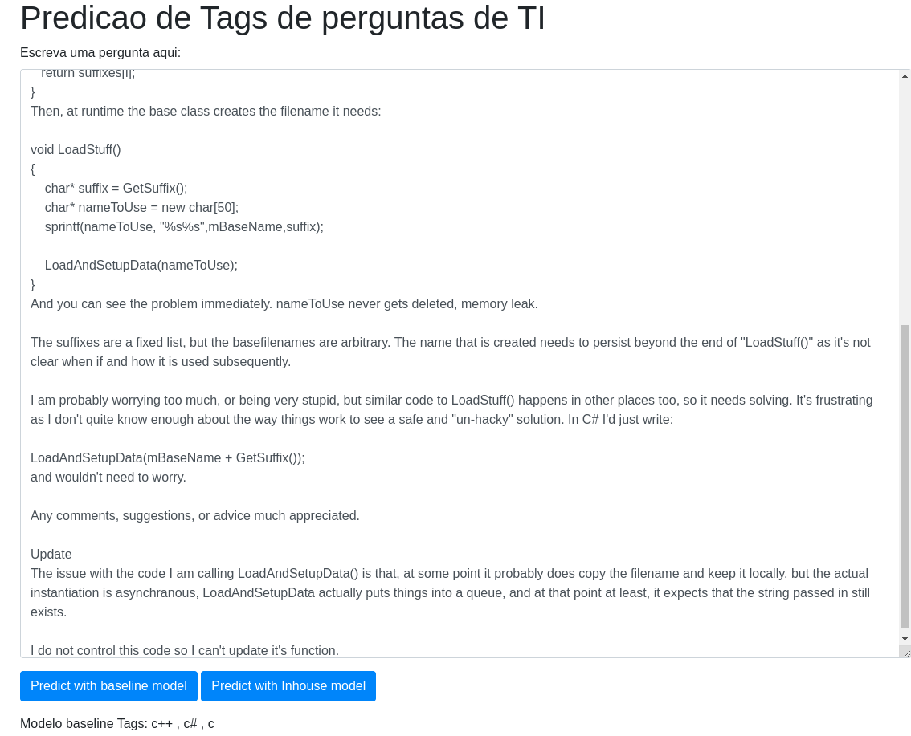

# Projeto NLP

## Avaliação Final – NLP

Objetivo: elaborar, desenvolver, avaliar e entregar um produto de dados baseado em IA e NLP.

Proposta do Projeto: Classificação de perguntas voltadas a programação

O objetivo do meu projeto é automatizar a parte de classificação de perguntas voltadas a TI tendo em vista a linguagem que está sendo usada e o assunto da pergunta. O banco de dados utilizado para treinar os modelos foi retirado da pagina https://www.kaggle.com/datasets/stackoverflow/stacksample do kaggle e ha uma versao estendida dessa base de dados no seguinte link: https://archive.org/download/stackexchange .

### Preparação dos Dados:

O banco de dados da página do kaggle disponibiliza dois arquivos csv, **Questions.csv** e **Tags.csv**. O arquivo **Questions.csv** possui o id da pergunta e o corpo em HTML da pergunta enquanto **Tags.csv** possuía o id da pergunta e uma tag associada a ela. Com dados em mãos, defini o target sendo a Tag e a feature sendo o body da pergunta. 
Pelo fato de uma pergunta possuir uma ou mais tags associadas a ela acabei criando um dataframe pandas que continha duas colunas : a primeira contendo o corpo da pergunta porém agora limpo e sem tags do HTML e a segunda contendo uma lista python de tags.
Essa ideia, apesar de promissora, é de difícil implementação devido a quantidade de espaço necessária para fazê-la,  uma vez que o banco de dados inicial possui aproximadamente 37035 tags únicas e 1264216 perguntas. Supondo o caso de uma regressão logística simples teria de ser feito 37035 colunas dummies o que deixaria o data Frame extremamente pesado.
Para contornar essa situação resolvi diminuir para somente 150 tags e consequentemente o número de perguntas acabou diminuindo também (não tanto quanto o número de tags). Para diminuir ainda mais o tamanho da DataFrame decidi que treinaria os dois modelos com somente 50% da data completa.

Quantidade de perguntas que possuem as 150 Tags mais comuns: 

### Modelos de NLP/ML implementados:

1. Baseline:
    
    O modelo baseline foi feito utilizando a biblioteca do python scikit-learn. Usei um Count Vectorizer com limite de 10000 tokens únicos e com exclusão de stop-words em inglês para fazer a tokenização e em seguida fiz uma regressão logística simples.

    Accuracy do modelo: 0.542843099

2. Inhouse:

    O modelo inhouse foi feito utilizando o tensor Flow. Inicialmente transformei o dataFrame do pandas em um Dataset do Tensor Flow.Em seguida fiz a tokenização com texto Vectorization. A rede neural escolhida para fazer o modelo foi uma CNN com embedding que ao final do processo retorna um layer  denso com 150 valores determinando a probabilidade da pergunta a ser prevista ser de determinada tag.A função de perda utilizada foi entropia cruzada categórica. Foram feitas 10 epochas 

    

    Accuracy do modelo: 0.4809
    Loss final: 2.3057

## Como rodar o projeto
Dentro da pasta do projeto:

<code>pip install -r requirements.txt</code>

<code>cd app</code>

<code>uvicorn main:app --reload</code>

Com o navegador utilize o atalho **Ctrl+O** e abra o arquivo index.html

Caso não funcione, troque as linhas 24 e 35 com a url correta da API no arquivo **app/index.html**

Funcionará melhor em inglês.

## Considerações finais e testes

As acurácias alcançadas com os modelos não foram altas porém são consistentes e funcionam relativamente bem para perguntas pequenas ou médias e diretas. Possíveis iterações podem ser feitas no futuro para melhorar o desempenho dos modelos: aumentar quantidade de perguntas e tags para treinamento e no caso do modelo inhouse, escalar a CNN para aguentar maior quantidade de dados.

Boas predições :

Pergunta: https://stackoverflow.com/questions/278363/c-string-manipulation?rq=3

Outra pergunta: https://stackoverflow.com/questions/76426419/rails-validation-errors-not-displaying-in-console

Predicao nao tao boa :

Pergunta: https://stackoverflow.com/questions/76424563/how-can-i-fix-the-issue-with-my-github-pages-yml-file-when-launching-my-jekyll-w

